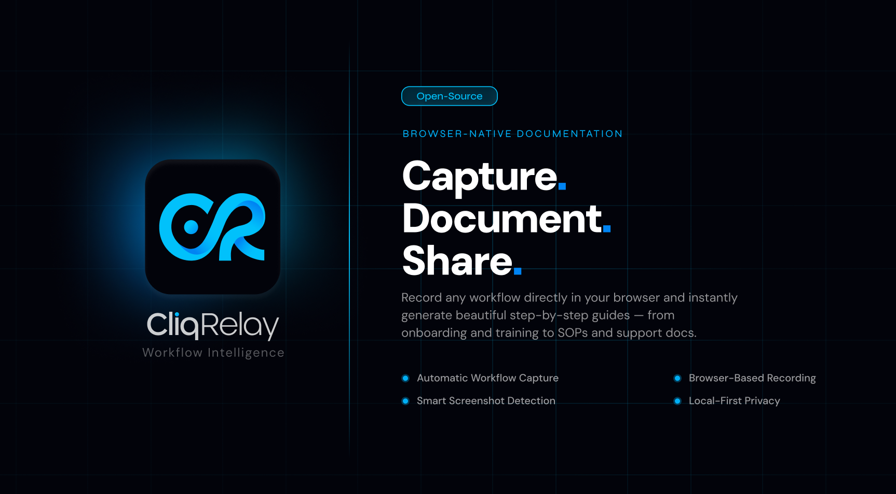

<p align="center">
  
</p>

<div align="center">

### [Become a Sponsor!](https://buy.polar.sh/polar_cl_rCWK2EGUoQFDeBQmObwQi4NRLEHCBRSpicW0m10vLjo)

</div>

---

### Overview

**CliqRelay** is an open-source platform that transforms page clicks and interactions into beautiful, step-by-step visual documentation. By coupling a native browser capture extension with a high-performance backend, CliqRelay tracks exact DOM interactions and contextual screenshots thereby instantly automating the heavy lifting of writing technical guides and docs. Capture and refine workflows instantly to help your teams perform at their best.

---

### Features

- **Instant Capture**: Capture workflows in real-time with a Chrome extension that listens for user interactions and captures them.
- **Contextual Screenshots**: Automatically capture screenshots during interactions to provide visual context.
- **AI-Powered Refinement**: Use AI to automatically refine captured workflows into clear, step-by-step guides that are easy to follow and share. (coming soon)
- **Seamless Sharing**: Share guides with your team to ensure everyone has access to the best practices and workflows. (coming soon)

---

### Self-Hosting

You can run the full CliqRelay stack locally or on your own infrastructure.

**Prerequisites:**
- [Docker](https://docs.docker.com/engine/install/) and [Docker Compose](https://docs.docker.com/compose/install/)

**1. Start the backend stack:**

```bash
$ docker compose --env-file docker-compose.prod.env -f docker-compose.prod.yml down -v && \
  docker compose --env-file docker-compose.prod.env -f docker-compose.prod.yml build --parallel && \
  docker compose --env-file docker-compose.prod.env -f docker-compose.prod.yml up -d
```

**2. Build the browser extension and install it in Chrome:**

Follow the `apps/extension` project's README for this step. This will enable you to run it as a local extension.

---

### Contributing

Your contributions are welcome! Here's how you can get involved:

- If you find a bug, please [submit an issue](https://github.com/CliqRelay/cliqrelay/issues).
- Set up your development environment by following our [Contribution Guide](./.github/CONTRIBUTING.md).
- Contribute code by making a [pull request](https://github.com/CliqRelay/cliqrelay/) to enhance features, improve user experience, or fix issues.

---

### Support & Community

Join our growing community for support, discussions, and updates:

- [Discord Server](https://discord.gg/FBM65P7GpZ)

If you'd like to support the ongoing development of this project, consider subscribing on Polar!

[](https://buy.polar.sh/polar_cl_rCWK2EGUoQFDeBQmObwQi4NRLEHCBRSpicW0m10vLjo)

---

### GitHub Stars

[](https://www.star-history.com/#CliqRelay/cliqrelay&type=date&legend=top-left)

---

### Our Sponsors

#### 🏢 Corporate Sponsors

#### 🥇 Gold Sponsors

#### 🥈 Silver Sponsors

#### 🥉 Bronze Sponsors

---
